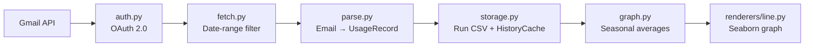

<div align="center">

# home-water-usage

A Python CLI that pulls Gmail water-usage alert emails, parses daily consumption figures, and renders an interactive Seaborn line graph with seasonal average overlays.

[](https://github.com/jeffskinnerbox/home-water-usage/stargazers)
[](https://www.python.org/)
[](https://github.com/astral-sh/uv)

</div>

## What is this?

My water utility emails an alert only when daily household usage exceeds a configured threshold — no dashboard, no trends, no history. `home-water-usage` eliminates that friction: given a date range, it authenticates with Gmail via OAuth, fetches the relevant alert emails, parses consumption figures, and renders a Seaborn line graph overlaid with Annual, Winter, Spring, Summer, and Fall average lines computed from your full history. Days with no alert appear as breaks in the line. A date-stamped PDF can optionally be saved before the interactive window opens.

## Quick Start

**Prerequisites:** Linux desktop with `$DISPLAY` set, `uv` installed, and `credentials.json` from Google Cloud Console placed at `~/.config/home-water-usage/credentials.json`.

```bash
# Install
git clone https://github.com/jeffskinnerbox/home-water-usage.git
cd home-water-usage
uv sync

# Run
uv run home-water-usage --start-date 2025-01-01 --end-date 2025-12-31

# Save a PDF too
uv run home-water-usage --start-date 2025-01-01 --end-date 2025-12-31 --save-pdf
```

First run opens a browser for OAuth. Subsequent runs refresh the token automatically. After the first run, history is cached locally — re-runs over the same range skip Gmail entirely and render in under 10 seconds.

## Pipeline



Each stage emits `[→]` progress and `[✓]` success messages via `rich`. Failures print `[✗]` with a "Likely cause:" line and exit 1.

## Configuration

All defaults live in `parameter_values.yaml`. Every key has a CLI flag override — no source editing required.

```bash
# Common overrides
uv run home-water-usage \
  --start-date YYYY-MM-DD \
  --end-date   YYYY-MM-DD \
  --graph-title "My Usage" \
  --save-pdf \
  --pdf-path /tmp/report.pdf \
  --no-delete-temp \
  --refresh-cache

uv run home-water-usage --help   # full flag list
```

Key defaults:

| Key | Default | Purpose |
|-----|---------|---------|
| `temp_dir` | `~/.local/share/home-water-usage` | Where CSVs are stored |
| `y_axis_percentile_cap` | `99` | Clips outliers at the 99th percentile |
| `buffer_email_count` | `3` | Buffer emails on each side of the date range |
| `delete_temp_files` | `true` | Delete run CSV after graph display |

## Project Structure

```
home-water-usage/
├── specs/
│   └── 001-water-usage-cli/    # Plan, spec, tasks, contracts, quickstart
├── src/
│   └── home_water_usage/
│       ├── renderers/
│       │   └── line.py         # Seaborn line renderer (pluggable via --chart-type)
│       ├── auth.py             # Gmail OAuth 2.0, 3-step credentials discovery
│       ├── cli.py              # argparse + YAML → Config, pipeline orchestration
│       ├── config.py           # Config dataclass with type coercion
│       ├── fetch.py            # Gmail query, pagination, retry with backoff
│       ├── graph.py            # Seasonal averages + renderer dispatch
│       ├── models.py           # UsageRecord, SeasonalAverage dataclasses
│       ├── parse.py            # Regex parse of email body → UsageRecord
│       ├── status.py           # rich-formatted [✓]/[→]/[!]/[✗] helpers
│       └── storage.py          # Run CSV + persistent HistoryCache
├── tests/
│   ├── fixtures/               # Canned Gmail API JSON responses
│   ├── conftest.py             # Shared fixtures (base_config, sample_records)
│   └── test_*.py               # 75 tests, 100% offline
├── constitution.md             # Non-negotiable project principles
├── parameter_values.yaml       # All runtime defaults
├── PRD.md                      # Full product requirements
└── quickstart.md               # Validation scenarios 1–10
```

## Documentation

| File | Description |
|------|-------------|
| [`quickstart.md`](quickstart.md) | Setup guide + 10 validation scenarios |
| [`parameter_values.yaml`](parameter_values.yaml) | All configurable defaults |
| [`PRD.md`](PRD.md) | Full product requirements and user stories |
| [`constitution.md`](constitution.md) | Non-negotiable design principles |
| [`gmail_api_setup.md`](gmail_api_setup.md) | Google Cloud Console credential setup |
| [`specs/001-water-usage-cli/plan.md`](specs/001-water-usage-cli/plan.md) | Implementation plan |

## Tests

All 75 tests run offline — no Gmail credentials required.

```bash
uv run pytest tests/test_cli.py -v
uv run pytest tests/test_auth.py -v
uv run pytest tests/test_fetch.py -v
uv run pytest tests/test_parse.py -v
uv run pytest tests/test_storage.py -v
uv run pytest tests/test_graph.py -v
uv run pytest tests/test_integration.py -v
```

> **Note:** Run one module at a time. The full suite loads seaborn/numpy/pandas simultaneously and may consume all available RAM on memory-constrained machines.

